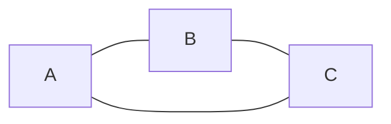
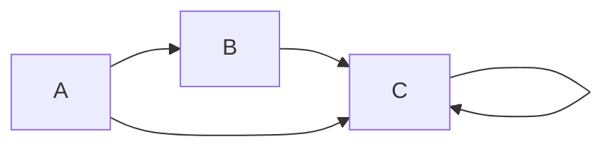
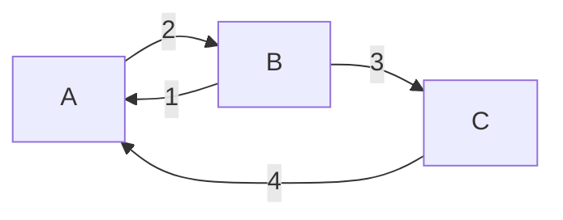
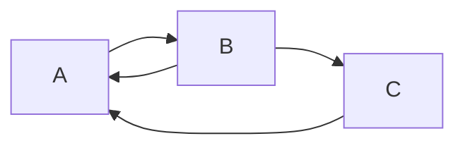
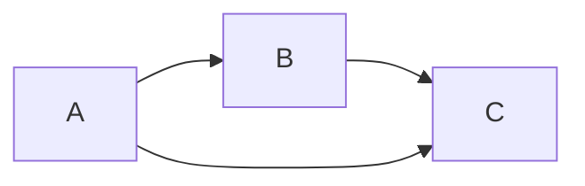

## Graphs

A graph is a set of nodes and edges connecting the nodes.

### There are multiple types of graphs:
- Undirected Graph: The edges don't have a direction, thus A-B is the same as B-A.
Example:

- Directed Graph: The edges have a direction each. Thus, A-B represents an edge from A to B.
Example:

- Weighted Graph: The edges in a weighted graph have a numerical value to them, representing any quantitative feature about the connections.

- Cyclic Graph: If we can reach any node again after starting to traverse from the same node, the graph is termed to be cyclic.

In the graph above, we can reach A again if we go down the sequence A --> B --> C --> A.
- Acyclic graph: A graph which doesn't have a cycle formed for any node, is termed to be acyclic in nature.

Note: If the weights for a graph's edges is not given, but we require them for solving a problem, then we can assume that all the edges have a weight of 1.

### A few more definitions related to graphs:

Node: entity to store data

Edge: to represent connections between nodes

Degree(v): in case of undirected graph, degree of node v is the number of edges connected to v

Indegree(v): in case of directed graph, number of edges coming towards node v

Outdegree(v): in case of directed graph, number of edges coming out of node v

Path: sequence of nodes where any node occurs no more than once
