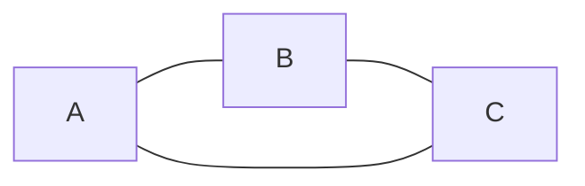
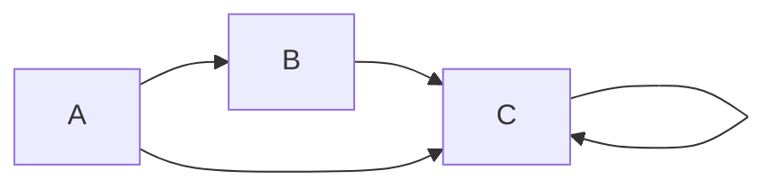
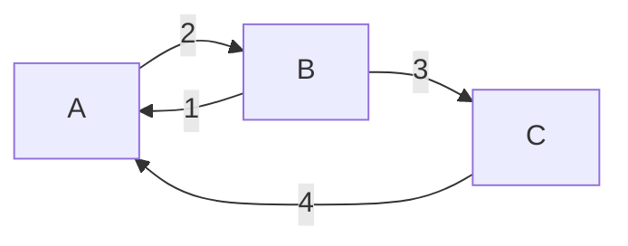
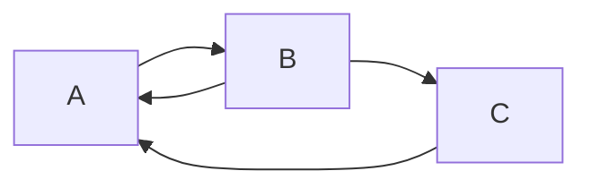
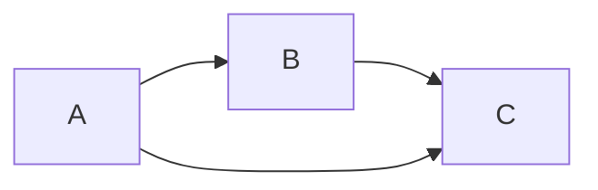
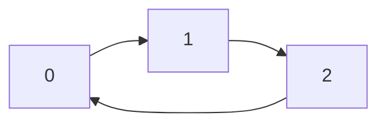
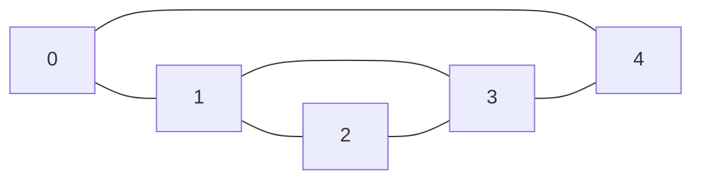

## Graphs

#### Conventions followed:
- All the code files have sample input and expected output at the bottom of the file.

A graph is a set of nodes and edges connecting the nodes.

### There are multiple types of graphs:
- **Undirected Graph**: The edges don't have a direction, thus A-B is the same as B-A.
Example:

- **Directed Graph**: The edges have a direction each. Thus, A-B represents an edge from A to B.
Example:

- **Weighted Graph**: The edges in a weighted graph have a numerical value to them, representing any quantitative feature about the connections.

- **Cyclic Graph**: If we can reach any node again after starting to traverse from the same node, the graph is termed to be cyclic.

In the graph above, we can reach A again if we go down the sequence A --> B --> C --> A.
- **Acyclic graph**: A graph which doesn't have a cycle formed for any node, is termed to be acyclic in nature.

Note: If the weights for a graph's edges is not given, but we require them for solving a problem, then we can assume that all the edges have a weight of 1.

### A few more definitions related to graphs:

**Node**: entity to store data 
**Edge**: to represent connections between nodes 
**Degree(v)**: in case of undirected graph, degree of node v is the number of edges connected to v 
**Indegree(v)**: in case of directed graph, number of edges coming towards node v 
**Outdegree(v)**: in case of directed graph, number of edges coming out of node v 
**Path**: sequence of nodes where any node occurs no more than once

### Ways to represent graphs in code:
1. *Adjacency Matrix*
2. *Adjacency List*

The data we are usually provided in graph-based questions (specifics may vary question to question and platform to platform):
*n* -> the number of nodes 
*m* -> the number of edges 
*E* -> the list of edges

1. **Adjacency Matrix**:

Suppose, for an example:
n = 3, m = 3, and E = {0 -> 1, 1 -> 2, 2 -> 0}

Now, based on the information, we need to create a 2D matrix as follows:

|Start\End|0|1|2|
|-|-|-|-|
|0|0|1|0|
|1|0|0|1|
|2|1|0|0|

Space Complexity of the matrix: O(n2)

2. **Adjacency List**:

As the graph grows bigger, we realise that most of it is filled with zeros and the matrix turns sparse. To counter the wasted space, we use adjacency lists.

Suppose, for an example, we have the following graph:

Here, n = 5, m = 6, and E = {0 -- 1, 0 -- 4, 1 -- 2, 1 -- 3, 2 -- 3, 3 -- 4}

Thus, adjacency lists formed would be:
|Nodes|Connected to|
|-|-|
|0|1, 4|
|1|0, 2, 3|
|2|1, 3|
|3|1, 2, 4|
|4|0, 3|

#### Possible implementations:

- List of lists
- Map (Key -> Int/Node, Value -> List of Ints/Nodes) (Preferred due to list restrictions)

> Generic Graph Implementation (Printing Adjacency Lists): *1_generic_graph.py*