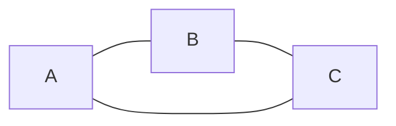
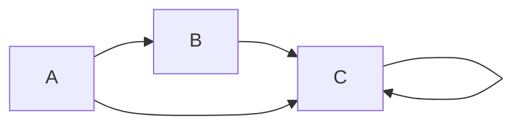

## Graphs

A graph is a set of nodes and edges connecting the nodes.

There are multiple types of graphs:
- Undirected Graph: The edges don't have a direction, thus A-B is the same as B-A.
Example:

- Directed Graph: The edges have a direction each. Thus, A-B represents an edge from A to B.
Example:

Node: entity to store data

Edge: to represent connections between nodes

Degree(v): in case of undirected graph, degree of node v is the number of edges connected to v
Indegree(v): in case of directed graph, number of edges coming towards node v
Outdegree(v): in case of directed graph, number of edges coming out of node v
